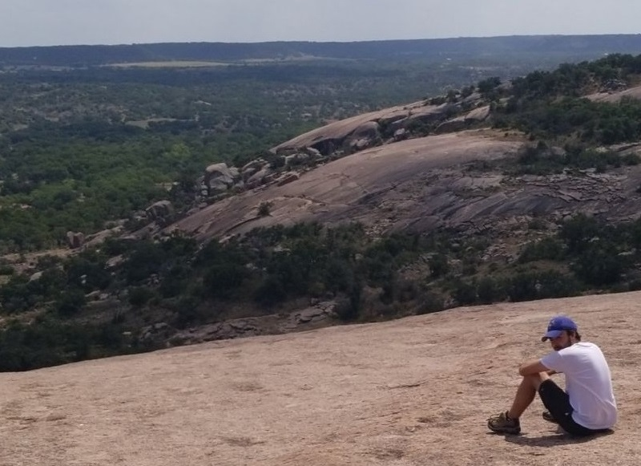

<p align="center">
    
</p>
<div align="center">
<h1> Dylan Souvage Personal Website </h1>

[](https://travis-ci.org/firefelix/dsouvage-homepage)   [](https://coveralls.io/github/firefelix/dsouvage-homepage?branch=master) [](https://codeclimate.com/github/firefelix/dsouvage-homepage/maintainability)
[
](https://github.com/firefelix/dsouvage-homepage/blob/master/LICENSE)

<a href="https://firefelix.github.io/dsouvage-homepage">Website Link/Live Demo</a>

</div>

This is a personal webpage for [Dylan Souvage](https://www.linkedin.com/in/dylan-souvage/), built using React and deployed to GitHub pages.

Do you have any suggestions? Feel free to contact me via LinkedIn or please make an issue!

## ⚙ Tech Stack

Created with [React](https://reactjs.org/) and [`create-react-app`](https://create-react-app.dev/)  
Content pulled from [gitconnected](https://gitconnected.com/portfolio-api)  
Code style enforced with [eslint](https://eslint.org/) and [Prettier](https://prettier.io/)  
Styled with [styled-components](https://www.styled-components.com) and [Sass](https://sass-lang.com/)  
Package maintained with [npm](https://www.npmjs.com/)  
Continuous Integration with [TravisCI](https://travis-ci.org/)  
Continuous Deployment with [gh-pages](https://github.com/tschaub/gh-pages)  
Testing done with [Enzyme](https://enzymejs.github.io/enzyme/) [react-script](https://create-react-app.dev/docs/running-tests/)  
Code coverage with [Coveralls](https://coveralls.io/)
Maintainability of code with [Code Climate](https://codeclimate.com/)

## 🛠 Installation

Clone the repo to local

```bash
git clone https://github.com/firefelix/dsouvage-homepage.git
```

Use the package manager [npm](https://www.npmjs.com/) to install/deploy.

```bash
npm install
```

### Usage

Running on local:

```bash
npm run start
```

## 🏎 Deploying

This app is set up with continuous integration via [TravisCI](https://travis-ci.org/) and continous deployment via [gh-pages](https://github.com/tschaub/gh-pages), assuming code passes all linting and testing.

Before submitting PR (run prettier, eslint and tests):

```bash
npm run predeploy
```

## Credit

(If you want to build something similar, without simply cloning the repo and changing values (feel free to do that btw))

[Deploying React app to GitHub Pages via Travis CI](https://medium.com/@rossanodan/deploying-a-react-application-on-github-pages-via-travis-ci-ba0fc2c4c74)

[Parallax Star background in CSS - Saransh Sinha](https://codepen.io/saransh/pen/BKJun)

[Awesome Developer Portfolio](https://levelup.gitconnected.com/build-an-awesome-developer-portfolio-website-using-react-667abd7bab4d)

[Navbar](https://www.w3schools.com/css/css_navbar.asp)

[Testing with React](https://scotch.io/tutorials/testing-react-components-with-enzyme-and-jest)
